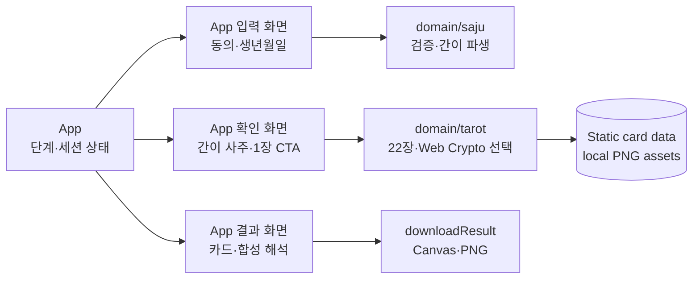

# D2. 컴포넌트 설계서 — 타로섯다

- Owner: 김형준 (`@procloudkim`)
- Reviewer: 미배정
- Status: Implemented — Review pending
- Related ADR: [`ADR-0001-tarot-mvp-architecture.md`](../adr/ADR-0001-tarot-mvp-architecture.md)
- Related Claims: 없음 — 제품 내부 설계 계약
- Last Verified Commit: `0fed3aa`

## 1. 목적과 현재 상태

사용자 한 명이 `히어로·동의·생년월일 입력 → 오늘의 간이 사주 확인 → 타로 1장 뽑기 → 카드+사주 합성 결과 → PNG 저장`을 완주하는 정적 웹을 위한 최소 컴포넌트 설계다.

`Last Verified Commit`에는 React 19·TypeScript·Vite 8 기반 입력, 사주 확인, 1장 추첨, 결과와 PNG 저장이 구현돼 있다.

### 범위 하드룰

- 단일 사용자, 페이지 세션당 타로 **1장**만 뽑는다.
- 호스트, 게스트, 룸, PIN, 실시간 동기화, 순위, 우승자, 베팅은 만들지 않는다.
- 원본 생년월일은 브라우저 메모리에서만 처리하고 서버·스토리지·로그·분석 도구로 보내지 않는다.
- 결과는 오락용 해석이며 과학적 예측이나 의사결정 근거로 표현하지 않는다.

## 2. 구현 상태

| 영역 | 구현 @ `0fed3aa` |
|---|---|
| 웹 앱 | React 단일 페이지 4상태 흐름 |
| 화면 | 입력, 사주 확인/뽑기, 결과 |
| 도메인 | 간이 사주 파생, 22장 타로, 무가중 1장 선택 |
| 데이터 | 정적 TypeScript 카탈로그와 동일 출처 PNG 22장 |
| 백엔드 | 사용하지 않음 |
| 저장 | 메모리 상태와 사용자가 내려받는 Canvas PNG만 사용 |

## 3. 구현 구조



의존 방향은 `UI → 순수 도메인 로직 → 브라우저 네이티브 API`다. 백엔드·라우터·전역 상태 라이브러리·Canvas 외부 의존성은 추가하지 않는다.

## 4. 컴포넌트 책임

| 컴포넌트 | 상태 | 책임 | 소유 상태 / 출력 |
|---|---|---|---|
| `App` (`src/App.tsx`) | Implemented | `HERO_INPUT → SAJU_CONFIRM → DRAWING → RESULT` 전이와 입력·결과 UI를 한 파일에서 소유한다. 카드 확정 시 원본 입력을 지우고 재뽑기를 막는다. | `step`, 동의, `birthDate`, `SajuResult`, `DrawResult`, 오류 |

`EntryForm`은 `<form>`, `<input type="date">`, `required`, `FormData`를 우선한다. 출생시각·양음력 등 추가 필드는 받지 않는다.

## 5. 도메인 모듈

| 모듈 | 상태 | 책임 | 비책임 |
|---|---|---|---|
| `domain/saju.ts` | Implemented | 날짜 검증, 엔터테인먼트용 `SajuResult` 생성 | 원본 저장, 카드 선택, 과학적 예측 |
| `domain/tarot.ts` | Implemented | 카탈로그 검증과 Web Crypto 기반 무가중 1장 선택 | 순위, 족보, 가중 확률, 재뽑기, 2장 조합 |
| `data/tarot.ts` | Implemented | 메이저 아르카나 22장의 이름·이미지·해설·파티 문구 | 추첨과 상태 관리 |
| `downloadResult.ts` | Implemented | 로컬 이미지·텍스트를 Canvas에 조합해 PNG 다운로드 | 서버 렌더링, 파일 업로드, 영구 저장 |

타로 선택은 `crypto.getRandomValues()`와 rejection sampling을 사용해 22개 index를 균등하게 만든다. 각 카드의 선택 확률은 정확히 `1/22`이다. `Math.random()`과 단순 modulo는 사용하지 않는다. 뽑기 후 `DrawResult`가 있으면 CTA를 비활성화하고 도메인 함수를 다시 호출하지 않는다.

## 6. 상태와 개인정보 소유권

| 데이터 | 소유자 | 수명·전송 | 하드룰 |
|---|---|---|---|
| 동의·생년월일 원본 | `App` | 확인 화면까지 메모리, 카드 확정 시 reset | URL, `localStorage`, `sessionStorage`, 콘솔, 분석, 네트워크 전송 금지 |
| `SajuResult` | `App` | 현재 페이지 메모리; 새로고침 시 파기 | 원본 날짜를 포함하지 않음 |
| 22장 카드 데이터·이미지 | 앱 번들 | 정적 배포 | 개인정보 없음; 이미지 사용 권리 확인 |
| `DrawResult` | `App` | 현재 페이지 메모리; 새로고침 시 파기 | 현 세션에서 다시 선택 금지 |
| Canvas·PNG blob | `ResultView` | 생성 즉시 다운로드, 링크 클릭 다음 작업 큐에서 Object URL 해제 | 업로드·서버 저장 금지 |

정적 앱만으로는 새로고침·새 탭·다른 브라우저의 재뽑기를 강제로 막을 수 없다. MVP의 `1장`은 **페이지 세션 내 UX 규칙**이며, 일일 제한을 구현했다고 주장하지 않는다.

## 7. 유스케이스–컴포넌트 매핑

| 유스케이스 | UI | 도메인 / Browser API | 실패 표시 |
|---|---|---|---|
| UC-01 동의·생년월일 입력 | `EntryForm` | `calculateTodaySaju(BirthInput, today)` | 미동의, 빈 값, 존재하지 않는/미래 날짜 |
| UC-02 오늘의 간이 사주 확인 | `DrawView` | `SajuResult` 표시 | 계산 불가 시 입력 화면 복귀 |
| UC-03 타로 1장 뽑기 | `DrawView` | `drawOneCard(TAROT_CARDS, crypto)` | Web Crypto 미지원/오류, 중복 클릭 무시 |
| UC-04 합성 결과 보기 | `ResultView` | `DrawResult`의 카드 해설 + `SajuResult` | 이미지 로드 실패 시 텍스트 결과 유지 |
| UC-05 PNG 저장 | `ResultView` | Canvas 2D, `toBlob`, object URL, `<a download>` | 저장 불가 안내; 화면 결과는 유지 |

UC 번호는 `01_USE_CASE_SPEC.md`가 확정되면 같은 커밋에서 동기화한다.

## 8. 실제 파일 구조

```text
src/
  App.tsx                 # 4개 내부 상태 전이·메모리 상태·오류 경계
  data/tarot.ts           # 카드 22장 이름·이미지·해설
  domain/
    saju.ts               # 입력 검증·SajuResult
    tarot.ts              # 22장 정적 데이터·균등 1장 선택
  downloadResult.ts       # Canvas 합성·PNG 다운로드
public/tarot/             # 22장 PNG
```

이 구조로 부족하다는 실제 증거가 나올 때까지 `router/`, `store/`, `hooks/`, `services/`, `repository/`, `adapter/`, `utils/`는 추가하지 않는다. 타입은 가장 가까운 모듈에 둔다.

## 9. 배포 구성

| 배포 단위 | Proposed 계약 |
|---|---|
| Vite 정적 산출물 | `npm run build`의 `dist/`만 정적 호스팅에 배포한다. 호스팅 제공자와 URL은 확정 후 기록한다. |
| 에셋 | 카드 이미지는 동일 origin의 번들 에셋으로 두어 Canvas taint와 외부 요청을 피한다. |
| 실행 환경 | HTTPS에서 Web Crypto·Canvas·download 동작을 모바일 390×844, 데스크톱 1440×900에서 검증한다. |
| 백엔드·환경 변수 | 없음. secret, DB, API, 실시간 서비스를 배포하지 않는다. |

## 10. 보안·접근성·오류 경계

### 보안·개인정보

- 원본 출생정보를 URL, storage, 콘솔, 오류 메시지, analytics에 넣지 않는다.
- 타로·히어로 이미지는 저작권/이용 허락을 확인한 로컬 자산만 사용한다.
- 외부 이미지 URL을 Canvas에 그리지 않으며, 사용자 입력을 HTML로 실행하지 않는다.
- 임시 blob URL은 다운로드 직후 `URL.revokeObjectURL()`로 해제한다.

### 접근성

- 동의·날짜 입력에 표시 라벨과 `aria-describedby`로 연결한 오류를 제공한다.
- 뽑기·저장은 실제 `<button>`으로 만들고 중복 실행 중에는 `disabled`와 텍스트 상태를 함께 제공한다.
- 파생·뽑기·저장 상태는 `aria-live`로 알리고 오류 시 첫 오류로 포커스를 이동한다.
- 카드 이미지에 카드명·핵심 의미 대체 텍스트를 두고, 결과 텍스트는 이미지 안에만 가두지 않는다.
- 카드 뒤집기 효과는 `prefers-reduced-motion` 시 즉시 전환으로 대체한다.

### 오류·복구

| 오류 | 처리 위치 | 복구 |
|---|---|---|
| 미동의·날짜 오류 | `EntryForm` | 필드 아래 원인 표시, 입력 유지 |
| 사주 파생 오류 | `EntryForm` | 오락용 계산 불가 안내, 수정 후 재제출 |
| Web Crypto 오류 | `DrawView` | 뽑기 미완료 상태 유지, 재시도 허용 |
| 카드 이미지 로드 오류 | `ResultView` | 카드명·해설 텍스트는 계속 표시 |
| Canvas/PNG 생성 오류 | `ResultView` | 화면 결과 유지, 다운로드만 재시도 |
| React 렌더링 오류 | `AppErrorBoundary` | PII 없는 대체 화면·새로고침 |

## 11. 구현·검증 순서

1. `domain/tarot.ts`에 22장 ID·이미지 경로·해설 완전성과 무가중 1장 선택의 실행 검증을 남긴다.
2. `EntryForm` + `domain/saju.ts`로 원본 정보가 브라우저 밖으로 나가지 않는 흐름을 검증한다.
3. `DrawView`에서 한 번의 성공한 뽑기 후 추가 선택이 발생하지 않음을 검증한다.
4. `ResultView` + `downloadResult.ts`의 완성 PNG, object URL 해제, 이미지 실패 fallback을 검증한다.
5. 모바일 390×844·데스크톱 1440×900에서 키보드, 감소된 모션, 콘솔·실패 요청 0건을 검증한다.

테스트 프레임워크는 현재 설치되지 않았다. 비자명 로직은 새 의존성 대신 가장 작은 실행 가능 자체 검증 또는 기존 빌드에서 실행 가능한 단일 테스트를 우선한다. 완료 증거는 구현 후 `docs/QA_EVIDENCE.md`에 배포 URL, viewport, 시각, commit SHA, 캡처, 콘솔·네트워크 결과로 남긴다.

## 12. 오픈 결정

| 결정 | 현재 상태 | 해결 게이트 |
|---|---|---|
| 간이 사주 규칙/라이브러리와 필수 입력 | 미정 | 검증 기준·케이스를 포함한 후속 ADR |
| 22장 이미지 출처·라이선스 | 미정 | 에셋 생성/선정 전 공개·상업 이용 범위 기록 |
| 카드별 해설·파티 문구 | 미정 | 22개 스키마 리뷰·낙인 없는 카피 검수 |
| 정적 호스팅 URL | 미정 | 배포 후 URL·commit SHA를 QA 증거에 기록 |
