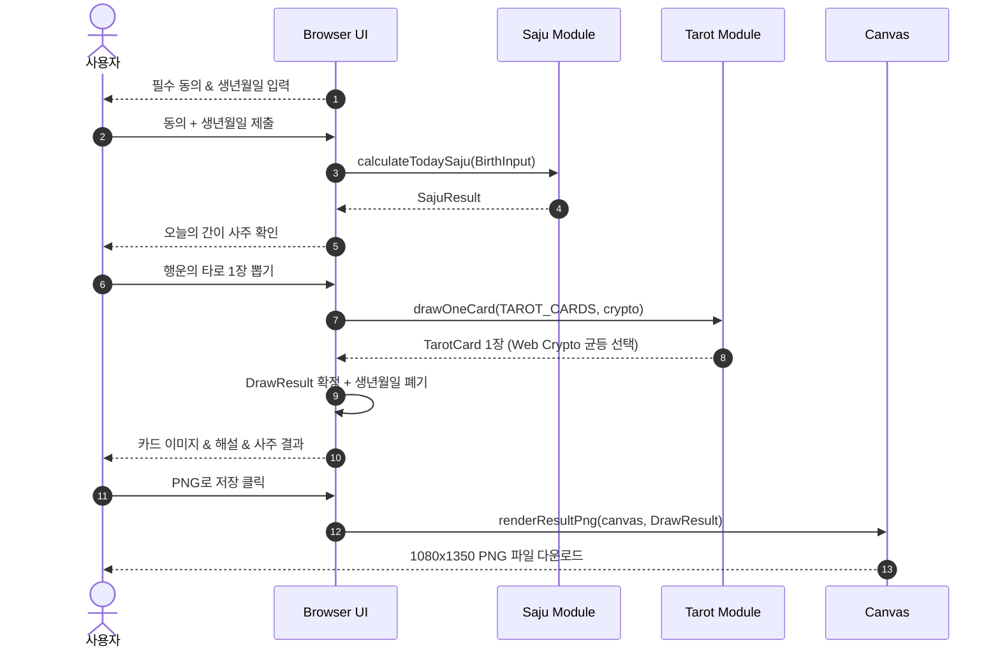

# D4: 시퀀스 다이어그램 (Sequence Diagram)

- **Owner**: 김형준 (@procloudkim), 김경민 (@kyoungmin24)
- **Reviewer**: 팀 Reviewer
- **Status**: Completed (1인 타로 운세 + 멀티 룸 오행 케미 및 1:1 QR 매칭)
- **Related ADR**: ADR-0001, ADR-0002, ADR-0003
- **Related Claims**: 없음
- **Last Verified Commit**: bd5e97d

---

## 1. 1인 타로 운세 & PNG 저장 시퀀스 (UC-01)

---

## 2. 멀티 파티 룸 동시 공개 & 오행 케미 및 1:1 QR 시퀀스 (UC-03)

```mermaid
sequenceDiagram
    autonumber
    actor Host as 호스트 브라우저
    actor Guest as 게스트 브라우저
    participant Channel as Room Channel

    Note over Host,Guest: 전원 카드 1장 배분 완료 및 준비 상태

    Host->>Channel: reveal(pin) (일괄 공개 트리거)
    Channel-->>Host: RoomState (REVEALED, 최강 운세 우승자)
    Channel-->>Guest: RoomState (REVEALED, 최강 운세 우승자)

    rect rgb(30, 41, 59)
        Note over Host,Guest: [클라이언트 독립 연산]<br/>1. pickDeficientElement(myElements)<br/>2. generatePartyMission(participants)
        Host->>Host: ElementalChemistryCard 렌더링 (지목 1~3명 & 미션)
        Guest->>Guest: ElementalChemistryCard 렌더링 (지목 1~3명 & 미션)
    end

    opt 1:1 현장 QR 매칭 시
        Host->>Guest: 내 사주 QR 코드 제시 (SharedSajuPayload)
        Guest->>Guest: calculateSynergyMatch(me, partner)
        Guest->>Guest: 1:1 시너지 점수 & 대화 카드 팝업
    end
```

