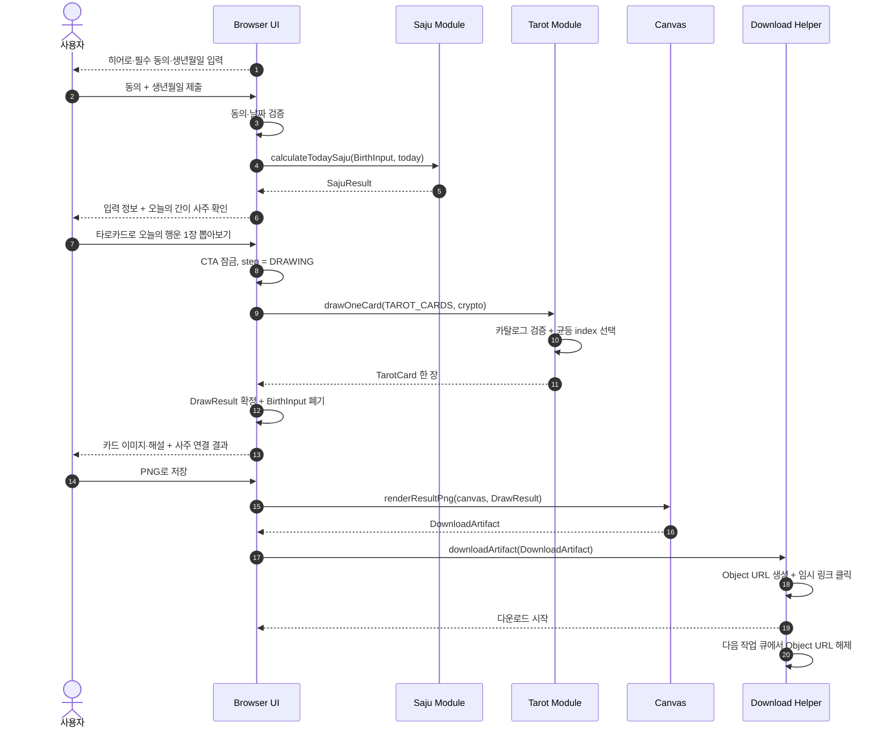
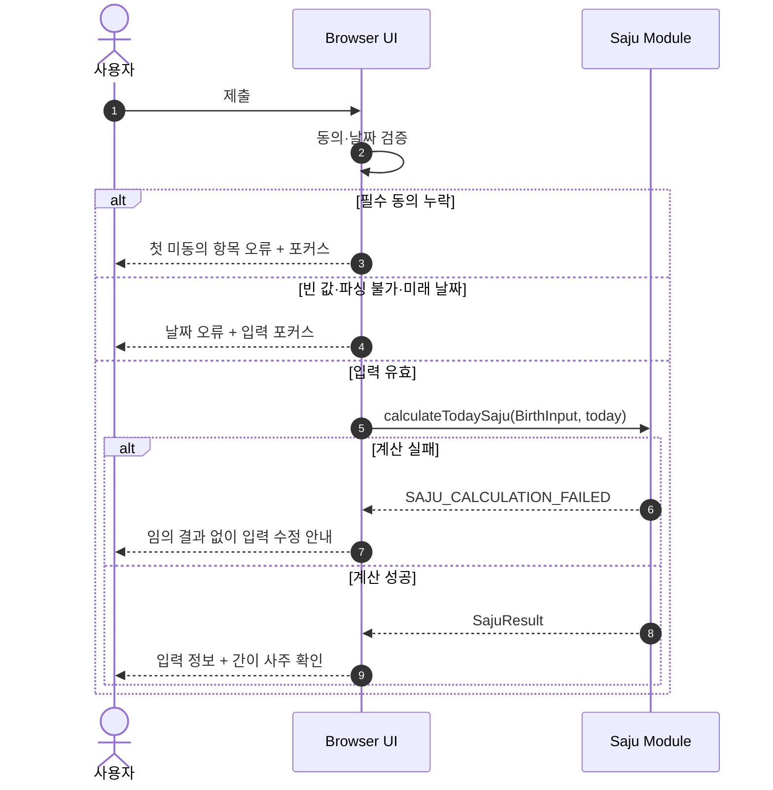
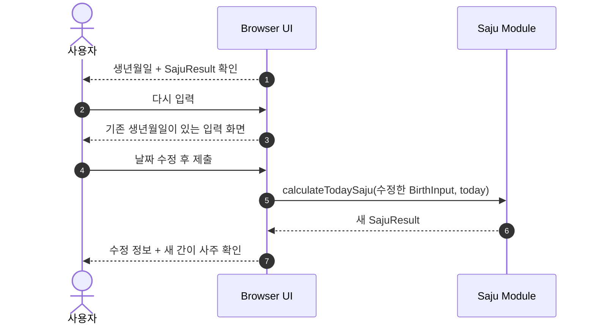
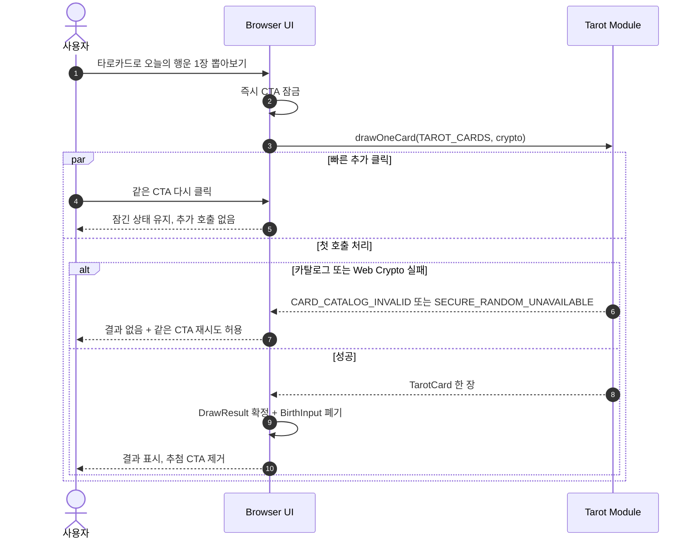
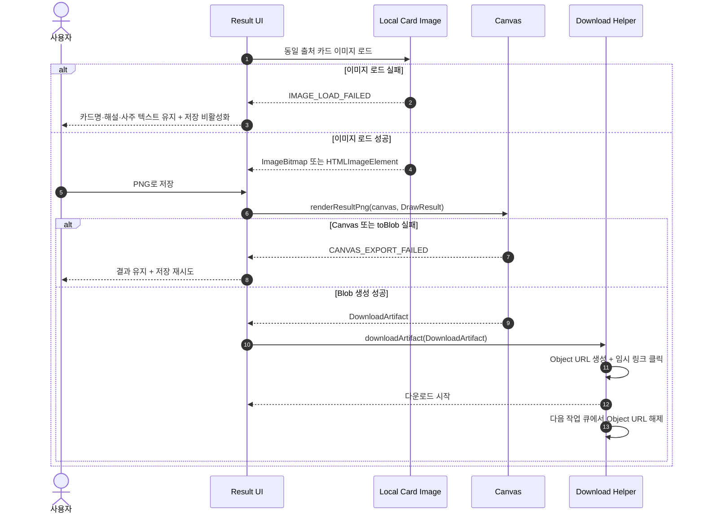

# D4. 시퀀스 다이어그램 — 타로섯다

- Owner: 김형준 (`@procloudkim`)
- Reviewer: 미배정
- Status: Proposed
- Related ADR: [`ADR-0001-tarot-mvp-architecture.md`](../adr/ADR-0001-tarot-mvp-architecture.md)
- Related Claims: 없음 — 제품 내부 설계 계약
- Last Verified Commit: `1f9bca6` (Vite 스타터, 아래 시퀀스 미구현)

## 1. 경계와 상태

- 모든 참여자는 한 브라우저 안의 UI 또는 로컬 모듈이다. API, 백엔드, 데이터베이스, 실시간 연결은 없다.
- 상태는 `HERO_INPUT → SAJU_CONFIRM → DRAWING → RESULT`로만 전이한다.
- 성공한 추첨 이후 `SAJU_CONFIRM`이나 두 번째 추첨으로 돌아가는 전이는 없다.
- `BirthInput`은 확인 단계까지만 메모리에 유지하고 카드가 확정되면 지운다.

## 2. 정상 흐름: 동의·생년월일 → 사주 확인 → 한 장 → PNG

정상 흐름에서 네트워크 요청은 빌드의 정적 자산뿐이다. 생년월일, 사주 결과, 카드 결과를 요청·URL·로그·브라우저 저장소에 기록하지 않는다.

## 3. 예외: 미동의 또는 잘못된 날짜

오류 경로에서는 카드 선택을 호출하지 않는다. 계산 성공 전까지 입력값은 사용자가 고칠 수 있도록 현재 폼 메모리에만 남는다.

## 4. 분기: 확인 화면에서 다시 입력

이 분기는 카드가 확정되기 전에만 가능하다.

## 5. 예외: 추첨 실패와 중복 클릭

실패 전 재시도는 허용하지만 성공한 결과 뒤 재추첨은 없다. `Math.random()` 대체도 없다.

## 6. 예외: 이미지 또는 PNG 생성 실패

다운로드 실패는 이미 확정된 카드 결과를 바꾸지 않는다.

## 7. 구현 대조 체크리스트

- [ ] 실제 컴포넌트·함수·상태 이름이 D2·D3와 일치한다.
- [ ] 정확한 CTA 문구와 `HERO_INPUT → SAJU_CONFIRM → DRAWING → RESULT` 전이가 일치한다.
- [ ] 한 성공 흐름에서 `drawOneCard` 호출과 `DrawResult`가 각각 하나다.
- [ ] 계산 전·확인 중·추첨 후의 생년월일 수명이 문서대로인지 확인한다.
- [ ] 이미지·Canvas·Blob 실패에서도 HTML 결과와 확정 카드가 유지된다.
- [ ] Network·URL·콘솔·Storage에 사용자 데이터가 없음을 확인한다.
- [ ] 구현 증거를 `docs/QA_EVIDENCE.md`에 URL, 시각, viewport, commit SHA와 함께 연결한다.
