# D4: 시퀀스 다이어그램 (Sequence Diagram)

- **Owner**: 미정
- **Reviewer**: 미정
- **Status**: Draft
- **Related ADR**: ADR-0002
- **Related Claims**: 없음
- **Last Verified Commit**: 07a88de

---

## 1. 동시 공개 및 오행 케미 미션 시퀀스 (UC-03)

```mermaid
sequenceDiagram
    autonumber
    actor Host as 호스트 브라우저
    actor Guest as 게스트 브라우저
    participant Server as 룸 상태 서버
    
    Note over Host,Guest: 전원 카드 1장 배분 완료 및 READY 상태
    
    Host->>Server: POST /rooms/:id/reveal (동시 공개 트리거)
    Server-->>Host: 200 OK (룸 상태 -> REVEALED)
    Server-->>Guest: Event: room_revealed { participants: [{id, nickname, primaryElement}] }
    
    rect rgb(30, 41, 59)
        Note over Host: [클라이언트 독립 연산]<br/>1. pickDeficientElement(myElements)<br/>2. generatePartyMission(participants)
        Host->>Host: ElementalChemistryCard 렌더링 (지목 1~3명 & 미션)
    end
    
    rect rgb(30, 41, 59)
        Note over Guest: [클라이언트 독립 연산]<br/>1. pickDeficientElement(myElements)<br/>2. generatePartyMission(participants)
        Guest->>Guest: ElementalChemistryCard 렌더링 (지목 1~3명 & 미션)
    end
    
    opt 소셜 공유 시
        Guest->>Guest: ShareableResultCard (타인 닉네임 제외 안전 공유)
    end
```

