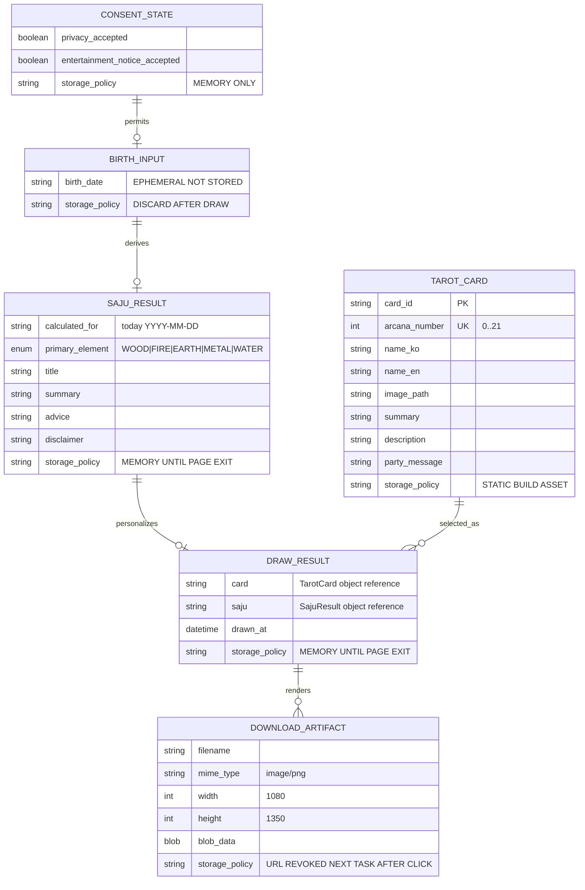
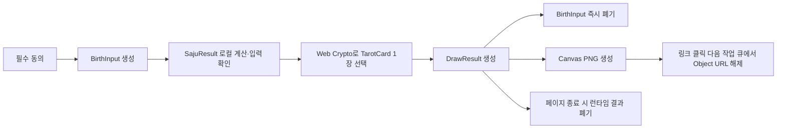

# D5. 타로섯다 클라이언트 논리 ERD

- Owner: 김형준 (`@procloudkim`)
- Reviewer: 미배정
- Status: Proposed
- Related ADR: [`ADR-0001-tarot-mvp-architecture.md`](../adr/ADR-0001-tarot-mvp-architecture.md)
- Related Claims: 없음 — 제품 내부 설계 계약
- Last Verified Commit: `1f9bca6`

> 이 문서는 데이터베이스 스키마가 아니다. `1f9bca6` 기준 영속 DB는 없으며, 아래 모델은 한 페이지 세션의 React 메모리와 정적 카드 카탈로그 관계만 표현한다.

## 1. 논리 관계



도식의 관계는 객체 참조를 설명할 뿐 DB 키나 테이블 생성을 뜻하지 않는다. `PK/UK`는 정적 카드 카탈로그의 고유 ID와 번호만 표시한다.

## 2. 모델 책임과 수명

| 모델 | 책임 | 위치 | 수명 |
|---|---|---|---|
| `ConsentState` | 필수 동의 두 항목의 현재 체크 상태 | React 메모리 | 페이지를 닫거나 새로고침할 때까지 |
| `BirthInput` | 사주 계산과 입력 확인에 필요한 생년월일 | React 메모리 | 카드 확정 즉시 빈 값으로 덮어쓰고 참조 해제 |
| `SajuResult` | 오늘의 대표 오행과 간이 해설 | React 메모리 | 페이지를 닫거나 새로고침할 때까지 |
| `TarotCard` | 메이저 아르카나 22장의 이미지·문구 | 소스 코드와 동일 출처 정적 자산 | 해당 릴리스 수명 |
| `DrawResult` | 선택된 카드 한 장과 사주 결과 결합 | React 메모리 | 페이지를 닫거나 새로고침할 때까지 |
| `DownloadArtifact` | Canvas PNG Blob | 브라우저 임시 메모리 | 다운로드 링크 클릭 다음 작업 큐에서 Object URL 해제; 저장 파일은 사용자 소유 |

영속 TTL은 없다. 정적 카드 카탈로그 외 모든 런타임 데이터는 페이지 수명을 넘기지 않는다.

## 3. 무결성 규칙

```text
CHECK ConsentState.privacy_accepted = true before calculation
CHECK ConsentState.entertainment_notice_accepted = true before calculation

CHECK BirthInput.birth_date is a valid YYYY-MM-DD and not in the future
CHECK BirthInput reference is released immediately after DrawResult creation
CHECK SajuResult contains no birth_date or birth_time field

CHECK TarotCard count = 22
UNIQUE TarotCard.card_id
UNIQUE TarotCard.arcana_number
CHECK TarotCard.arcana_number covers 0..21 exactly
CHECK TarotCard image and required copy are non-empty
CHECK TarotCard has no rank, payout, rarity weight, or betting field

CHECK DrawResult count per page session <= 1
CHECK DrawResult.card references exactly one TarotCard
CHECK draw probability for every TarotCard = 1/22
CHECK no redraw transition exists after DrawResult creation

CHECK DownloadArtifact.mime_type = image/png
CHECK DownloadArtifact.width = 1080 and height = 1350
CHECK downloaded pixels/text contain no birth_date
```

이 규칙은 DB 제약이 아니라 타입, 순수 함수, 렌더링 가드와 최소 자동 테스트로 검증한다.

## 4. 개인정보 경계

### 4.1 NOT STORED

```text
birth_date          EPHEMERAL / NOT STORED
birth_time          NOT COLLECTED
calendar_type       NOT COLLECTED
leap_month          NOT COLLECTED
name                NOT COLLECTED
email               NOT COLLECTED
device_identifier   NOT COLLECTED
```

- `BirthInput.birth_date`는 사주 계산과 확인 화면에만 사용하고 결과 객체에 복사하지 않는다.
- 카드 확정 후 입력 state를 비우고 화면 DOM에서도 원본 값을 제거한다.
- localStorage, sessionStorage, IndexedDB, 쿠키, URL, API, 로그, 분석 도구에 사용자 데이터를 넣지 않는다.
- Canvas 결과물에도 생년월일과 동의 상태를 그리지 않는다.
- 사용자가 내려받은 PNG 파일의 보관·삭제는 사용자의 기기 제어 영역이다.

### 4.2 전송 경계

```text
Backend/API          없음
Realtime             없음
Database             없음
Authentication       없음
Server-side session  없음
User-data network    0 requests
```

브라우저 네트워크는 동일 출처의 HTML, JavaScript, CSS, 카드 이미지, 글꼴 같은 정적 자산만 요청한다.

## 5. 데이터 생성·폐기 순서



사주 계산 실패 시 `BirthInput`은 사용자가 수정할 수 있도록 입력 화면에만 남는다. 성공하지 않은 임의 사주나 카드 결과를 생성하지 않는다.

## 6. 현재 구현과 검증 계획

`1f9bca6` 기준 현재 데이터 모델 구현과 영속성은 모두 **없음**이다. 따라서 이 ERD의 모든 런타임 모델은 `Proposed`다.

구현 후 다음 증거로 검증한다.

- 실제 TypeScript 타입과 정적 카드 카탈로그 경로
- 카탈로그 22장, ID·번호 고유성, 필수 이미지·문구 테스트
- Web Crypto rejection sampling 경계값 테스트
- 한 세션에서 두 번째 추첨이 차단되는 테스트
- 카드 확정 후 DOM·React 상태·URL·Storage에서 생년월일 0건 확인
- API/XHR/fetch와 사용자 데이터 네트워크 요청 0건 확인
- 1080×1350 PNG 생성, Object URL 해제, PNG 내 생년월일 미포함 확인
- 실제 검증 commit SHA와 `docs/QA_EVIDENCE.md` 링크
