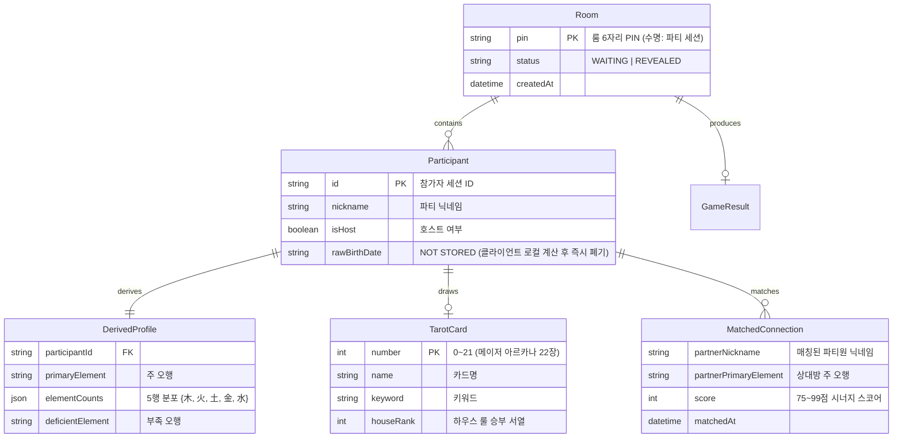

# D5: ERD (Entity Relationship Diagram) & 데이터 모델

- **Owner**: 김형준 (@procloudkim), 김경민 (@kyoungmin24)
- **Reviewer**: 팀 Reviewer
- **Status**: Completed (1인 타로 운세 + 멀티 룸 오행 케미 및 1:1 QR)
- **Related ADR**: ADR-0001, ADR-0002, ADR-0003
- **Related Claims**: 없음
- **Last Verified Commit**: bd5e97d

---

## 1. 논리 데이터 모델 (In-Memory / State Model)

---

## 2. PII (개인정보) 저장 정책

1. **원본 생년월일 / 출생시각**:
   - 브라우저 클라이언트 메모리에서 사주 오행 계산 즉시 폐기되며, 서버/로그/스토리지에 일체 저장되지 않습니다 (`NOT STORED`).
2. **세션 수명**:
   - 모든 인메모리 룸 상태 및 파생 데이터는 파티 종료 시 즉시 삭제됩니다.
