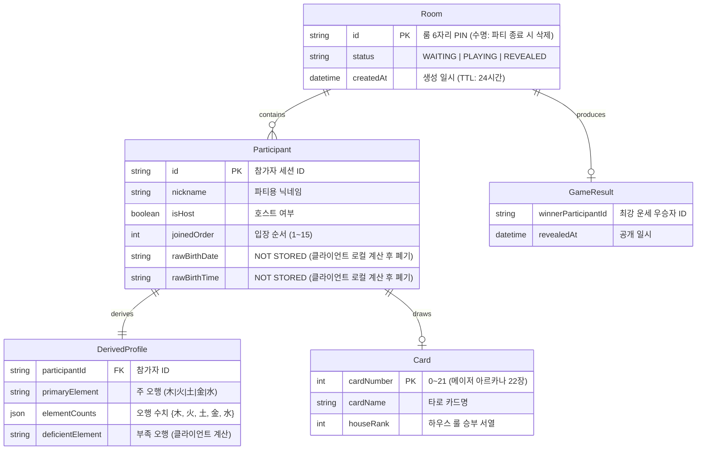

# D5: ERD (Entity Relationship Diagram) & 데이터 모델

- **Owner**: 미정
- **Reviewer**: 미정
- **Status**: Draft
- **Related ADR**: ADR-0002
- **Related Claims**: 없음
- **Last Verified Commit**: 07a88de

---

## 1. 논리 데이터 모델 (In-Memory / State Model)

---

## 2. PII(개인정보) 저장 정책

1. **원본 생년월일 / 출생시각**:
   - 브라우저 클라이언트 메모리에서 사주 오행 계산 즉시 폐기되며, 서버/로그/DB/스토리지에 일체 저장되지 않습니다 (`NOT STORED`).
2. **파티 룸 데이터 수명 (TTL)**:
   - 파티 종료 또는 세션 만료 시 모든 인메모리 룸 및 파생 프로필 데이터는 즉시 삭제됩니다.
